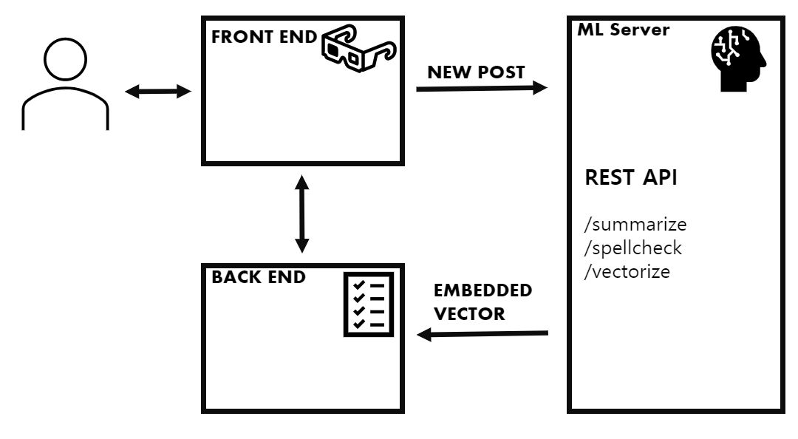

# AI of POOL

## 🔍한글 텍스트 요약 AI

자기계발은 끝없는 자신과의 싸움입니다. 이 과정에서 비롯된 자기계발 일지는 자칫, 자소서에 담기에는 너무나 방대한 분량의 내용이 될 수도 있습니다.

한국어 자연어 처리 AI 모델인 KoBART를 활용한 텍스트 요약 기술로 POOL에 잘 담아둔 내 군 생활 기록 중 핵심만을 골라 자기소개서에 넣어보세요! 뿐만 아니라 자기소개서에서 불필요한 내용을 줄이는 첨삭 용도로도 활용할 수 있습니다.

## ✍️자기소개서 작성 AI

자기소개서를 쓰는 것에 있어 가장 어려운 것은 자신의 스토리를 자기소개서 형식에 맞춰 적절히 전개해나가는 것 입니다.

POOL의 자기소개서 생성 기능을 이용해보세요! 연등 팀이 수집한 10000건 이상의 자기소개서 기반으로 조정된 kogpt2 모델 기반 POOL AI가 사용자가 작성한 문장에 어울리는 전개 방향을 추천해줍니다.

## 📌AI 기반 게시글 추천

> 알고리즘이 저를 여기로 이끌었습니다...

군대에서, 자유시간은 금만큼이나 귀한 것입니다.    
POOL에서는 이 귀한 시간을 최대한 아껴드리기 위해, AI 기반 게시글 추천을 제공합니다. 이 놀라운 알고리즘이 작동하는 방식은 다음과 같습니다.

1. 사용자가 글을 작성하면, AI 모델이 자동으로 해당 글에 대응하는 임베딩 벡터Embedding Vector를 생성합니다.
2. 이 임베딩 벡터는, 해당 글의 주요 내용, 문체 등 글의 전반적인 특징을 나타냅니다.     
(예를들어, `인공지능 관련, 낙관적, 취업 관련`과 같은 식입니다.)
3. 여러분이 POOL을 이용할 수록 여러분이 관심을 갖는 분야에 대한 기준 벡터가 계정에 등록됩니다.    
(예를들어, `대학원 진학, 스타트업, 사물인터넷`과 같은 식입니다.) 
4. 여러분이 새로운 글을 찾고자 하시면, AI가 이 기준 벡터를 이용해 여러분이 관심을 가질만한 글을 찾아줍니다!

## ✔️맞춤법 검사 기능

자기소개서에서는 물론, 모든 글의 첫인상은 맞춤법에서 좌우된다고 할 수 있습니다.    
그러나 글쓰기에 너무 집중하다 보면, 아무리 훌륭한 작가라도 맞춤법 실수를 하기 마련이죠. POOL에서는 맞춤법에 대한 걱정은 잠시 접어두셔도 괜찮습니다. 맞춤법 검사 기능이 탑재되어 있으니까요! 🤗

## ⚙️How does POOL AI works?

우리가 흔히 AI라 부르는 머신러닝 기능은 대부분 고사양의 기기를 필요로 하고, 연산이 오래 걸립니다.

POOL AI는 이런 고사양의 연산을 통해 좋은 품질의 결과를 제공하면서도, 사용자에게 빠른 응답성을 확보하기 위해 서비스 프론트앤드 / 백앤드 서버와 분리된 독립 서버에서 제공됩니다.

이를 통해 AI 서버가 불의의 사고로 중단되어도 서비스는 지속적으로 유지되며, 매 사용시마다 AI의 결과를 기다릴 필요없는 즉각적인 서비스 제공이 가능합니다.
