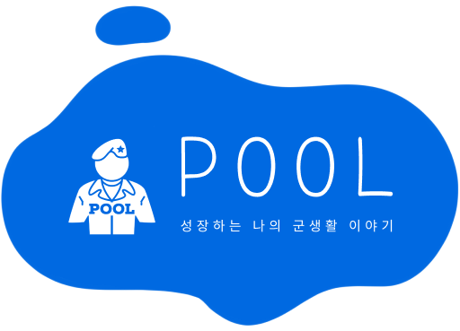

	데모 로그인 ID : <code>jusang@strapi.io</code> 
	데모 로그인 비밀번호 : <code>pool1234</code>

 
  

  

#

  

> **군생활동안 성장하는 나의 이야기를 기록하고 공유하는, 자기개발 및 취업연결 SNS 플랫폼 "POOL" 입니다.**

  

군대 안에서 울고 웃으며, 목표를 위해 노력하면서 성장하는 우리들. 그러나 세상은 우리가 '삽질' 중이라고 합니다. ***POOL*** 은 군생활 중에도 미래를 향해 달려가는 국군 장병들의 노력으로 채워집니다. 풀에 가득 채운 나의 군생활 및 자기개발 기록은, 내가 군생활을 헛되이 보내지 않았음을 증명하는 자료가 됩니다.

<a  href="https://osam.kr/projectBlog/63/intro">아이템 기획서 살펴보기</a>

  

## DEMO

<table align="center">
	<tr>
		<td>
			
		</td>
	</tr>
	<tr>
		<td align="center">
			<b>소개 영상</b>
		</td>
	</tr>
</table>
   

## 🤔 기획의도
국군 장병들은 최소 18개월에서 길게는 21개월, 더욱 길게는 수년간 사회와 격리된 특수한 환경에서 근무합니다. 결코 짧다고 할 수 없는 이 시간을 유의미하게 보내는 것은 쉽지 않으며, 나아가 이 시간을 사회에서 인정받는 것 또한 쉽지 않은 일입니다.

POOL은 군 복무기간을 유용하게 활용할 수 있도록 도와주는 **자기개발 플렛폼**이며, 나아가 군대에서의 노력을 취업이나 창업 등의 미래로 연결해주는 **맞춤 취업 연결 SNS 서비스** 입니다.

## 💡 주요기능
- **기록: 풀장에 빠져들듯 몰입되는 미래 그리기**
	- **군 복무기록 등록 및 인증**: 군 복무 중의 상훈 기록, 표창 내역등을 인증해줍니다.
	- **나만의 군 복무일지**: SNS 형식으로 본인의 군 복무 기록을 남길 수 있습니다.
	- **프로필을 이력서로**: 본인이 등록한 프로필을 이력서 형식으로 출력할 수 있습니다.
- **공유: 풀잎처럼 함께 성장하는 우리들**
	- **AI 기반 맞춤 뉴스피드**: 사용자의 관심 분야를 파악하는 AI로 맞춤 뉴스피드를 제공합니다.
	- **관심사별 "풀" 페이지**: 관심 분야별로 "풀"을 생성하여 같은 분야의 전우들과 소통하고 정보를 공유합니다.
- **연결: 군의 인력풀을 넘어 더 넓은 세상으로**
	- **취창업 정보 제공**: 사용자에게 맞는 박람회, 공모전, 채용 행사 등 취업 관련 행사 정보와 기업 정보를 제공합니다.
	- **기업 계정**: 관심있는 기업의 스토리, 채용정보 등을 볼 수 있는 기업 전용 계정입니다.

## 🔎 UI / UX

<table align="center">
	<tr>
		<td>
			
		</td>
		<td>
			
		</td>
	</tr>
	<tr>
		<td align="center">
			<b>프로필 페이지</b>
		</td>
		<td align="center">
			<b>피드 페이지</b>
		</td>
	</tr>
	<tr>
		<td>
			
		</td>
		<td>
			
		</td>
	</tr>
	<tr>
		<td align="center">
			<b>탐색 페이지</b>
		</td>
		<td align="center">
			<b>풀 페이지</b>
		</td>
	</tr>
</table>

## 🤷‍왜 POOL에 AI가 필요하죠?

POOL은 자기개발을 기록하고, 나아가 취업까지 연결해 주는 소셜 미디어형 서비스입니다. 그런 POOL에 왜 AI가 필요했을까요?  

자기개발은 어렵습니다. 하물며 이를 기록으로 남기고, 나아가 구직 활동에서까지 활용하는 것은 바쁘고 정신없는 군 생활 중에 쉽지 않은 일입니다.

POOL의 AI 기능들은 **어떻게 하면 자기개발을 효율적으로 기록하고, 나아가 잘 활용할 수 있을지**에 초점을 두고 있습니다.

POOL 서비스에 사용된 AI 기술에 대한 자세한 소개는 [여기](AboutAI.md)에서 확인하실 수 있습니다.

## 🖥️기술 스택 (Technique Used)

### WEB FRONTEND

- [Vue.js](https://vuejs.org/)
	- [Vuex](https://vuex.vuejs.org/)
	- [Vue-Router](https://router.vuejs.org/)
	- [Vuetify](https://vuetifyjs.com/)
- [TypeScript](https://www.typescriptlang.org/)

### WEB BACKEND

- [Node.js](https://nodejs.org/)
- [MongoDB](https://www.mongodb.com/)
- [Strapi](https://strapi.io/)
- [GitHub Actions](https://github.com/features/actions)

### ML BACKEND

- [pytorch](https://github.com/pytorch/pytorch)
	- [pytorch-lightning](https://github.com/PyTorchLightning/pytorch-lightning)
- [transformer](https://github.com/huggingface/transformers)
- [flask](https://github.com/pallets/flask)
	- [flask-restx](https://github.com/python-restx/flask-restx)

## 😎 팀 정보 (TEAM INFORMATION)
<table align="center">
<tr>
	<th>Name</th>
	<th>Role</th>
	<th>Contact</th>
	<th>GITHUB</th>
</tr>
<tr>
	<td>지우석</td>
	<td>Management, AI Engineering, Team Leader</td>
	<td>woosukji@naver.com</td>
	<td>woosukji</td>
</tr>
<tr>
	<td>최민규</td>
	<td>Front-end Development</td>
	<td>koongchi135@gmail.com</td>
	<td>somnisomni</td>
</tr>
<tr>
	<td>오주상</td>
	<td>Back-end Development</td>
	<td>dhwntkd412@snu.ac.kr</td>
	<td>ever2after</td>
</tr>
<tr>
	<td>백지오</td>
	<td>AI Engineering, Model Serving</td>
	<td>giopaik@naver.com</td>
	<td>skyil7</td>
</tr>
</table>
